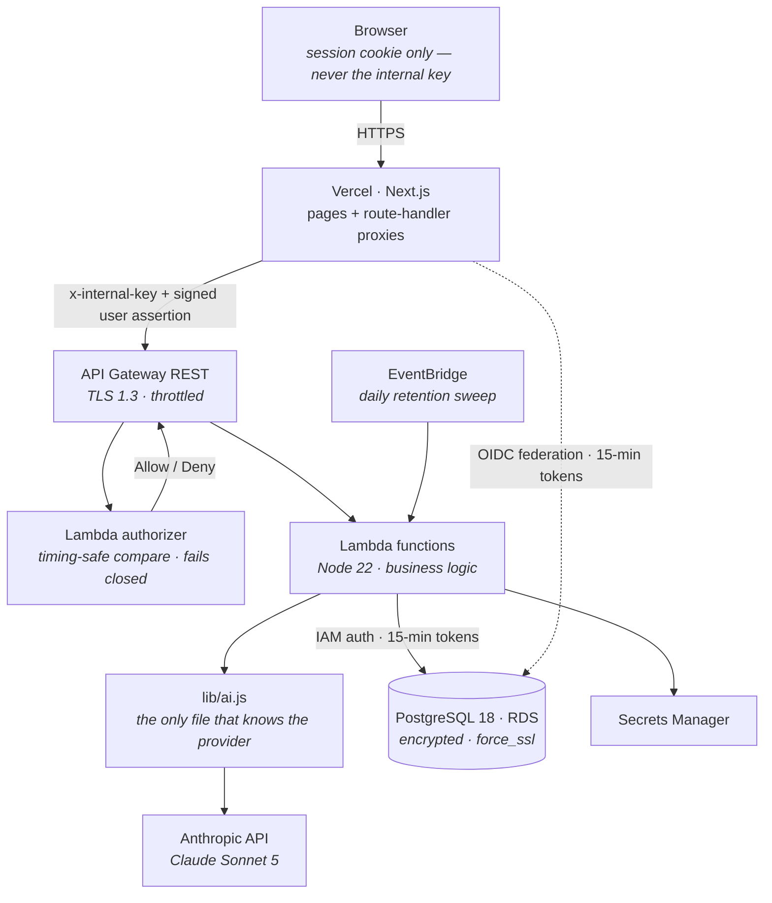

# Journaled

**An AI work-memory system: messy free-text in, structured professional records out.**

You type what you did today the way you'd say it out loud — *"fixed the printer thing at Northgate, 2h on the Meridian migration, standup, Acme called about the invoice"* — and Journaled parses it into discrete, queryable work events, writes the day's account in your own voice, and turns any date range into a report you can send to a manager or attach to an invoice.

Built solo over roughly two months: a Next.js frontend on Vercel, AWS Lambda functions behind API Gateway, PostgreSQL on RDS, and Claude Sonnet 5 behind a provider-agnostic service layer.

> **This repository is a curated showcase**, not the full source. It holds the architecture write-ups and a handful of files chosen because they carry the interesting decisions. The production repositories are private.

---

## Contents

- [What it does](#what-it-does)
- [Architecture](#architecture)
- [Engineering highlights](#engineering-highlights) — the four things worth reading
- [Selected source](#selected-source)
- [Deeper write-ups](#deeper-write-ups)
- [Decisions I reversed or refused](#decisions-i-reversed-or-refused)

```
├── README.md              you are here
├── docs/                  architecture · security · prompt system
├── aws/                   IAM policies and the reasoning behind them
└── src/                   four files that carry the interesting decisions
```

---

## What it does

**Capture.** One text box. The model parses a day-dump into discrete work events — description, activity type, optional client, project, and duration — and every draft is editable before it becomes real data. Nothing the model produces enters the system of record without a human confirming it.

**Account.** Each capture ships with a written summary of that day, in first person, in the user's voice.

**Report.** Any range up to 90 days becomes a narrative report assembled from every session in the window — generated asynchronously, because the interesting version of this problem doesn't fit inside an API Gateway request.

**Prove.** Everything exports to CSV or JSON with durations intact, for invoices, timesheets, or review evidence.

The product constraint that shaped every prompt in the system: **the model may never invent work.** It structures, groups, and renders what the person actually wrote. It never estimates a duration the user's words don't support, never adds an outcome the entries don't establish, and never grades the day. A tool whose output goes to your manager or your client cannot be caught embellishing, once.

---

## Architecture



The dotted line is the one that took the most work to get right, and it's the first highlight below.

**Stack:** Next.js 16 · TypeScript · Tailwind · NextAuth (JWT) · Node 22 Lambdas · API Gateway REST · PostgreSQL 18 on RDS · Amazon SES · EventBridge · Secrets Manager · Anthropic API · Vercel · Cloudflare

---

## Engineering highlights

### 1. No standing database credentials, anywhere

Four Next.js routes talk to Postgres directly, because they can't go through the authenticated API: sign-in and registration happen *before* a session exists. Originally they used a connection string in an environment variable — a permanent password sitting in a hosting provider's env store, with full rights, usable from anywhere by anyone who obtained it.

That's now replaced end to end. Vercel issues each production deployment a signed OIDC token; AWS is configured to trust that issuer; an IAM role accepts it **only** when the token's subject is exactly this project's production environment, and grants exactly one permission — `rds-db:connect` as a least-privilege database user. The app exchanges the token for temporary credentials and mints a fresh **15-minute** database token per connection.

The detail that makes it invisible in practice: `pg` accepts a *function* for `password`, so it's evaluated per new socket. Connections already open never notice the expiry.

```ts
return new Pool({
  host, port, database,
  user,
  // Runs for every NEW socket, not once at pool creation.
  password: () => signer.getAuthToken(),
  ssl,
  ...POOL_SHAPE,
});
```

Two decisions worth defending:

- **Explicit mode, never inferred.** `DB_AUTH_MODE` must be `static` or `iam`; anything else throws. It would have been easy to "fall back to the password if IAM fails" — and that fallback would quietly defeat the entire point on the day it mattered.
- **Production-only trust.** The role's trust policy pins the token subject to `environment:production`. Preview deployments carry genuine, correctly-signed tokens and are still refused, because their subject ends in `:preview`. Preview builds losing database access is the correct posture, not a bug.

Full file: [`src/db.ts`](src/db.ts) · Policies: [`aws/`](aws/) · Write-up: [`docs/security.md`](docs/security.md)

### 2. A rate limiter that survives concurrency and serverless

The realistic threat to this app was never a breach — it was a retry storm or a stolen session burning real money in model tokens. Two design choices carry it:

**Count attempts, not results.** Usage rows are written on every *attempt*, not on saved output. An abuser hammering the parse endpoint never saves anything — and that's precisely the case that costs money. Counting saved rows would miss it entirely.

**The ledger is the database, never the process.** On Vercel and Lambda the same route runs in as many concurrent instances as the platform likes, each with its own module scope, so an in-memory counter caps nothing.

And the bug that's easy to ship without noticing: a plain check-then-insert lets N parallel requests all read the same count and all pass, bounding overshoot by burst concurrency rather than by the limit. The fix is a transaction-scoped advisory lock per `(user, kind)`:

```js
await db.query('BEGIN');
await db.query(
  'SELECT pg_advisory_xact_lock(hashtext($1::text), hashtext($2))',
  [userId, kind]
);
// ...count within the rolling window, then insert only if permitted
```

The attempt is logged **only once it's permitted**, so a blocked user can't extend their own lockout by retrying. Windows are rolling rather than calendar-based: no timezone question, no midnight stampede, and capacity returns gradually.

Full file: [`src/limits.js`](src/limits.js)

### 3. Prompts treated as versioned, evaluated software

This is the part of the project I'd most want to talk about in an interview.

Every summary is stamped with a version string that includes **the model, not just the prompt** — because a prompt version alone would claim two outputs are comparable when a model swap had already made them different. Each generation also stores the model's original draft in a separate column, so later user edits never destroy the evaluation signal.

Changes were A/B tested on real inputs, with a second model reviewing anonymized outputs before deploy. Two findings worth keeping:

**Voice rules don't survive translation.** The English prompts taught first-person voice through English surface patterns — "does it use I/my?" That test is *vacuously true* in Spanish, a pro-drop language where correct sentences omit the subject pronoun entirely. Running the shared prompt on Spanish input produced invented teams ("hicimos el standup con el equipo") in six out of six runs. The fix wasn't translation; it was a forked prompt with native exemplars, teaching the same rule through Spanish surface patterns.

**The prompt's own examples teach the failure.** The single most stubborn defect — summaries narrating how long things took, which three separate rules forbade — traced back to a *positive* example inside the prompt that demonstrated the banned phrasing while illustrating something else. The model was following the example over the rule, correctly.

Write-up: [`docs/prompt-system.md`](docs/prompt-system.md)

### 4. Beating a hard platform ceiling

API Gateway REST caps a request at **29 seconds**, and it is not raisable. Report generation over a long range blew straight through it: 16 entries took about 24 seconds, and at 35 entries the same warm input would sometimes succeed at 26 seconds and sometimes time out — generation variance straddling the wall.

Rather than tune against a limit that would keep moving, the endpoint became a job queue: `POST` creates a row and asynchronously invokes a worker with a 300-second budget, the client polls, and the worker re-reads its own row and returns early unless the status is still pending — so a duplicate async delivery can't double-generate.

That unlocked a failure mode nobody would guess: at scale the model began hitting its **output token ceiling**, which returns *empty text* rather than an error. Around 70 entries produced silent empty summaries; around 180, truncation mid-sentence that passed a naive "is it empty?" check. Both now throw explicitly on `stop_reason: max_tokens`. A 180-entry week generates reliably today.

---

## Selected source

| File | Why it's here |
|---|---|
| [`src/db.ts`](src/db.ts) | OIDC-federated database auth; explicit-mode switch that refuses to guess |
| [`src/proxy.ts`](src/proxy.ts) | The trust boundary: the internal key never reaches a browser, and a per-user HMAC binds identity to it |
| [`src/limits.js`](src/limits.js) | Race-proof, tier-aware rate limiting on a shared database ledger |
| [`src/retention-sweep.js`](src/retention-sweep.js) | Scheduled data pruning: batched deletes, timeout-aware, safe under retry |
| [`aws/oidc-trust-policy.json`](aws/oidc-trust-policy.json) | The two conditions that decide which deployment may become a database client |
| [`aws/rds-connect-policy.json`](aws/rds-connect-policy.json) | The role's entire permission set — one action, one user, one instance |

Identifiers (AWS account numbers, hostnames, user IDs) are replaced with placeholders. Everything else is the code as it runs.

---

## Deeper write-ups

- [**Architecture**](docs/architecture.md) — request flow, data model, why the boundaries sit where they do
- [**Security**](docs/security.md) — the arc from an open port and a password in shell history to token-only auth with a live-fire-tested intrusion alarm
- [**Prompt system**](docs/prompt-system.md) — versioning, evaluation method, the Spanish fork, and the failures worth documenting
- [**AWS configuration**](aws/README.md) — the federated-access setup in order, the `rds_iam` grant that makes passwords impossible, and the CloudWatch filter that watches an internet-facing database

---

## Decisions I reversed or refused

Worth including, because the reasoning matters more than the outcome:

**Two recommended security fixes were refused after testing them against production.** An automated review proposed an atomic job-claim query that would have written a status value the live `CHECK` constraint rejects — it typechecked cleanly and would have failed on first execution. A second proposed change would have been silently swallowed by a query-string whitelist added the same week. The lesson stuck: *a green typecheck proves nothing about a fix that violates live schema or a guard added by someone else.*

**A prompt edit took down report generation for fifteen minutes.** Deleting a region of a prompt file swallowed the function that built the user message between the two deletion markers. `node --check` passed, because the result was still syntactically valid JavaScript. Standing practice since: prompt files are verified by *executing* the real functions against a stubbed fetch before deploy, and a region deletion asserts what the cut does **not** contain.

**Escaping is per-layer, not per-value.** An email address HTML-escaped into a `mailto:` href can still smuggle a `?bcc=` parameter, because the mail client entity-decodes the attribute *before* parsing the URI. Two encoders, two layers: `encodeURIComponent` for the href value, HTML escaping for the link text.

**Hard delete over soft delete.** Account deletion removes the row and lets nine foreign-key cascades clear everything beneath it. Soft-delete with a scheduled purge was considered and rejected: the privacy policy promises immediate deletion, and export-before-delete already covers the regret case. Recovery exists only as point-in-time restore, and is deliberately never promised to users.
